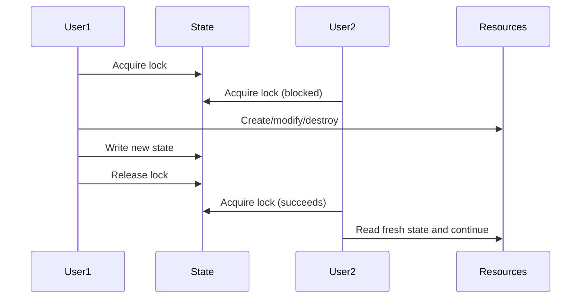

# Answer

The correct answer is **A**.

> It prevents concurrent runs from writing to the same state at the same time, avoiding state corruption.

---

## Why A Is Correct

State locking is a **concurrency control** mechanism. When multiple users or automation runs execute Terraform commands simultaneously against the same state file, without locking:

1. Both runs read the **same version** of the state
2. Both make independent changes
3. The **last write wins**, overwriting the other's changes
4. The state no longer matches reality → **state corruption**

With locking, the second run is blocked until the first releases the lock:



## How Locking Works with S3 + DynamoDB

| Component | Role |
|-----------|------|
| **S3 bucket** | Stores the state file (`terraform.tfstate`) |
| **DynamoDB table** | Stores the lock record (a single item per state file) |
| **Lock record** | Contains LockID, operation, user, timestamp, Terraform version |

The backend configuration:

```hcl
backend "s3" {
  bucket         = "my-terraform-state"
  key            = "terraform-004/terraform.tfstate"
  dynamodb_table = "terraform-state-locks"
}
```

DynamoDB must have a primary key named `LockID` (type String) for Terraform to use it for locking. Terraform writes a lock item when an operation starts and deletes it when the operation finishes.

## What Happens During a Lock Conflict

When a second operation tries to acquire the lock:

```
Error: Error acquiring the state lock

Lock Info:
  ID:        abc123
  Path:      my-terraform-state/terraform-004/terraform.tfstate
  Operation: OperationTypeApply
  Who:       jane@dev-machine
  Version:   1.9.0
  Created:   2025-01-15 10:30:00
```

The error includes diagnostic information so you can contact the lock holder.

## Force Unlock

If a process holding a lock crashes, the lock may be **stale**. Use `terraform force-unlock` to break it:

```bash
terraform force-unlock <LOCK_ID>
```

Only break locks when you are certain no operation is in progress. Breaking a live lock can cause state corruption.

## Backend Locking Support

| Backend | Supports Locking? | Lock Mechanism |
|---------|------------------|----------------|
| S3 | Yes (with DynamoDB) | DynamoDB table |
| AzureRM | Yes | Azure blob storage lease |
| GCS | Yes | Cloud Storage object lease |
| Consul | Yes | Consul session lock |
| HTTP | Partial | Depends on server implementation |
| Local | No (no remote state) | N/A |

## Disabling Locking

You can disable locking per-command:

```bash
terraform apply -lock=false
terraform plan -lock=false
terraform destroy -lock=false
```

This is **not recommended** in team environments — it recreates the exact concurrency problem locking is designed to prevent.

## Exam Tips

- Locking prevents **concurrent writes** that cause **state corruption**
- S3 alone does **not** support locking — you must add a **DynamoDB table**
- The DynamoDB table must have a primary key called `LockID` (String)
- `terraform force-unlock <LOCK_ID>` to break a stale lock
- `-lock=false` disables locking for a single command (dangerous in teams)
- Locking is about **write conflicts**, not about authentication or encryption
- Know which backends support locking and which don't
- The lock error message tells you **who**, **what operation**, and **when**
