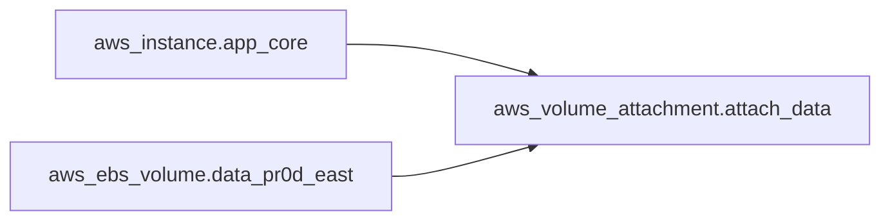

# Answer

The correct answer is **A — True**.

> The `aws_volume_attachment.attach_data` resource has **two** implicit dependencies: one on `aws_instance.app_core` and one on `aws_ebs_volume.data_pr0d_east`.

---

## Why True Is Correct

Every **attribute reference** to another resource creates an implicit dependency. The volume attachment resource contains two such references:

```hcl
resource "aws_volume_attachment" "attach_data" {
  device_name = "/dev/xvdf"
  volume_id   = aws_ebs_volume.data_pr0d_east.id  # ← implicit dep #1
  instance_id = aws_instance.app_core.id           # ← implicit dep #2
}
```

Terraform's dependency graph resolves to:

```
aws_instance.app_core ──────┐ (implicit via instance_id)
                             ├──→ aws_volume_attachment.attach_data
aws_ebs_volume.data       ──┘ (implicit via volume_id)
```

Terraform must create **both** the instance and the volume **before** it can create the attachment. The instance and volume have no dependency on each other, so they can be created **in parallel**, but the attachment always runs last.

## How Terraform Handles Multiple Dependencies



- **Instance** → **Attachment**: implicit (via `instance_id`)
- **Volume** → **Attachment**: implicit (via `volume_id`)
- **Instance** ⇢ **Volume**: no dependency (can run in parallel)

## Why "False" Is Incorrect

| Argument | Why It's Wrong |
|----------|---------------|
| "The attachment only depends on one of them" | Both `volume_id` and `instance_id` are attribute references — each creates its own implicit dependency |
| "Only explicit `depends_on` counts" | Implicit dependencies are the **primary** mechanism. `depends_on` is for cases where no attribute reference exists |
| "References don't always create dependencies" | In Terraform, any `resource_type.name.attribute` reference creates an implicit dependency — that's how the graph works |

## Implicit Dependency Rules

| Pattern | Dependency Created? | Example |
|---------|-------------------|---------|
| `resource_type.name.attribute` | ✅ Implicit | `instance_id = aws_instance.app_core.id` |
| `data.data_source.name.attribute` | ✅ Implicit | `vpc_id = data.aws_vpc.default.id` |
| `module.name.output` | ✅ Implicit | `subnet_id = module.vpc.public_subnet_id` |
| `var.name` | ❌ (input variable, not a resource) | `instance_type = var.instance_type` |
| `local.name` | ❌ (local value, not a resource) | `name = local.resource_name` |

## Exam Tips

- **Count the attribute references** — each `resource_type.name.attribute` = one implicit dependency
- A single resource can have multiple implicit dependencies (as shown here)
- Resources with no dependency chain run **in parallel**
- Resources with dependencies run **in sequence**
- Destroy order is the **reverse** of create order (attachment destroyed first, then volume and instance)
- The `terraform graph` command visualizes all dependencies
- Common exam pattern: a resource has multiple `id`/`arn`/`name` references — each is a separate implicit dependency
- The question asks about "both" — look for multiple `resource.attribute` references in the config
